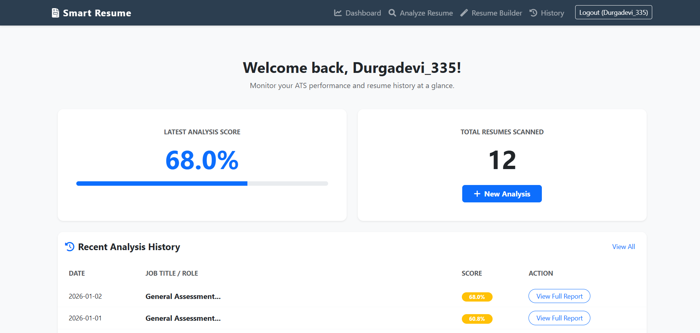
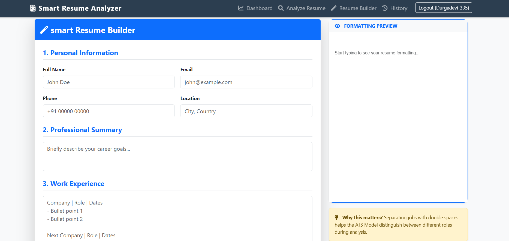
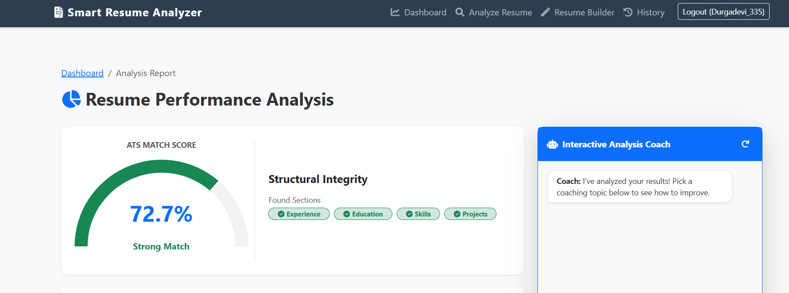

# 📄 Smart Resume Analyzer

An NLP-powered **Smart Resume Analyzer and Resume Builder** designed to help students, freshers, and job seekers create professional resumes, evaluate ATS compatibility, and measure resume-job description matching.

The system provides intelligent resume analysis, ATS scoring, skill-gap detection, job compatibility evaluation, and a built-in resume builder with real-time formatting preview.

---

## 🚀 Live Demo

🔗 https://smart-resume-analyzer-prku.onrender.com

## 💻 GitHub Repository

🔗 https://github.com/DurgaDevi335/Smart-Resume-Analyzer

---

# 📌 Problem Statement

Many students and job seekers struggle to create professional resumes and understand recruiter expectations.

Common challenges include:

- Not knowing how to structure a resume
- Missing important resume sections
- Low ATS compatibility
- Poor keyword optimization
- Lack of relevant technical skills
- Difficulty matching resumes with job descriptions

To address these challenges, this project provides an end-to-end platform that helps users build resumes, evaluate resume quality, identify missing skills, and improve placement readiness.

---

# 🎯 Objectives

- Build ATS-friendly resumes from scratch
- Analyze resume quality automatically
- Generate ATS-style scores
- Identify missing sections and skills
- Match resumes with job descriptions
- Provide personalized improvement suggestions
- Improve placement readiness and recruiter visibility

---

# ✨ Key Features

## 📄 Resume Analysis

- ATS Score Generation
- Resume Quality Assessment
- Structure Analysis
- Technical Skill Detection
- Experience Evaluation
- Readability Analysis
- Personalized Suggestions

---

## 🎯 Resume-JD Matching

- Resume and Job Description Comparison
- TF-IDF Vectorization
- Cosine Similarity Analysis
- Skill Gap Detection
- Missing Skill Identification
- Match Score Calculation
- Job Compatibility Analysis

---

## 📝 Resume Builder

- Create Resume from Scratch
- ATS-Friendly Resume Structure
- Professional Resume Sections
- Real-Time Formatting Preview
- Dynamic Resume Generation
- Beginner-Friendly Interface

This feature is especially useful for students and freshers who do not already have a resume.

---

## 📂 Resume History

- Track Previous Resume Analyses
- View Earlier Results
- Access Historical Resume Evaluations

---

# 🏗️ System Architecture

```text
                         ┌────────────────────┐
                         │ Resume Builder     │
                         │ Real-Time Preview  │
                         └─────────┬──────────┘
                                   │
                                   ▼
                           Professional Resume

────────────────────────────────────────────────────────

Resume Upload / Resume + JD Upload
                │
                ▼
        Text Extraction
     (PyMuPDF / docx2txt)
                │
                ▼
        Text Preprocessing
                │
                ▼
      ┌───────────────────┐
      │ Resume Only Mode  │
      └─────────┬─────────┘
                │
                ▼
      ATS Evaluation Engine
                │
                ▼
      ATS Score + Suggestions

────────────────────────────────────────────────────────

      ┌───────────────────┐
      │ Resume + JD Mode  │
      └─────────┬─────────┘
                │
                ▼
       TF-IDF Vectorization
                │
                ▼
         Cosine Similarity
                │
                ▼
        Skill Gap Detection
                │
                ▼
       Match Score Generation
                │
                ▼
       Suggestions & Insights
```

---

# 🧠 Technology Stack

## Backend

- Python
- Flask

## Frontend

- HTML
- CSS
- JavaScript

## NLP & Text Analysis

- TF-IDF Vectorization
- Cosine Similarity
- Text Cleaning
- Keyword Analysis

## Document Processing

- PyMuPDF
- docx2txt

## Data Processing

- Pandas
- NumPy

## Model Persistence

- Pickle

---

# 📊 Dataset

The project utilizes a dataset containing approximately **10,000 Resume–Job Description pairs**.

### Dataset Attributes

| Column Name | Description |
|------------|------------|
| Job Applicant Name | Applicant Name |
| Age | Applicant Age |
| Gender | Gender Information |
| Race | Race Category |
| Ethnicity | Ethnicity Details |
| Resume | Resume Text |
| Job Roles | Target Job Role |
| Job Description | Job Description Text |
| Best Match | Resume–Job Match Label |

### Dataset Usage

The dataset is used to build the TF-IDF vectorization pipeline and vocabulary required for semantic text comparison between resumes and job descriptions.

---

# ⚙️ Working of the System

## Mode 1: Resume-Only Analysis

When a user uploads only a resume:

### Step 1: Resume Parsing

The system extracts text from:

- PDF files using PyMuPDF
- DOCX files using docx2txt

### Step 2: Structure Analysis

Checks for important sections:

- Education
- Skills
- Projects
- Experience

### Step 3: Skills Analysis

The system compares resume content against a predefined technical skills repository.

Example:

- Python
- Java
- SQL
- Flask
- HTML
- CSS
- Git
- Machine Learning

### Step 4: Experience Analysis

Identifies:

- Action Verbs
- Achievement Statements
- Quantified Results

Examples:

- Developed
- Created
- Optimized
- Managed
- Led

### Step 5: Readability Analysis

Evaluates:

- Resume Length
- Content Density
- Overall Readability

### Step 6: ATS Score Generation

The final ATS score is calculated using:

```text
ATS Score =
Structure Score +
Skills Score +
Experience Score +
Readability Score
```

### Step 7: Suggestion Generation

The system provides recommendations such as:

- Missing Sections
- Weak Skill Coverage
- Lack of Quantified Achievements
- Poor Readability

---

# 🎯 Mode 2: Resume + Job Description Matching

When both Resume and Job Description are uploaded:

### Step 1: Text Extraction

Extract text from Resume and JD.

### Step 2: Text Cleaning

- Lowercasing
- Punctuation Removal
- Whitespace Normalization

### Step 3: TF-IDF Vectorization

Resume and JD text are converted into numerical vectors.

### Step 4: Cosine Similarity

Measures semantic similarity between Resume and Job Description.

### Step 5: Skill Gap Detection

The system identifies:

- Matching Skills
- Missing Skills
- Required Skills

### Step 6: Structure Evaluation

Checks completeness of the resume.

### Step 7: Match Score Calculation

The final score is generated using:

```text
Match Score =
(Cosine Similarity × 45)
+
(Skill Match Score × 35)
+
(Structure Score × 20)
```

### Step 8: Recommendation Generation

Provides:

- Missing Skills
- ATS Improvements
- Keyword Suggestions
- Resume Enhancement Recommendations

---

# 📈 ATS Scoring Methodology

| Component | Weight |
|------------|---------|
| Structure Analysis | 25% |
| Skills Analysis | 25% |
| Experience Analysis | 25% |
| Readability Analysis | 25% |

---

# 📂 Project Structure

```text
Smart-Resume-Analyzer/
│
├── app.py
├── ml_logic.py
├── requirements.txt
│
├── models/
│   ├── ats_model.pkl
│   └── vectorizer.pkl
│
├── templates/
│
├── static/
│
├── uploads/
│
├── dataset/
│
└── README.md
```

---

# 📸 Screenshots

## 🏠 Dashboard

Add dashboard screenshot here.

```markdown

```

---

## 📝 Resume Builder

The built-in Resume Builder allows users to create a professional resume from scratch with real-time formatting preview.



---

## 📄 Resume Analysis

Add Resume Analysis Result Screenshot.

```markdown

```

---

## 🎯 Resume-JD Matching

Add Resume-JD Matching Screenshot.

```markdown

```

---

# 🔮 Future Enhancements

- Advanced NLP-based Skill Extraction
- Dynamic Skill Repository
- Resume Ranking System
- Multi-JD Comparison
- AI-Powered Resume Suggestions
- Interview Question Recommendations
- Deep Learning-Based Semantic Matching
- Personalized Career Guidance

---

# 👩‍💻 Author

## Durga Devi Ravipati

**B.Tech – Computer Science and Engineering (Cyber Security)**  
Shri Vishnu Engineering College for Women

### Connect With Me

- GitHub: https://github.com/DurgaDevi335
- LinkedIn: https://www.linkedin.com/in/durga-devi-ravipati

---

## ⭐ If you found this project useful, consider giving it a star on GitHub!
